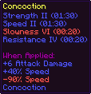
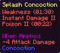
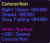
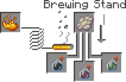

# Concoction

Minecraft's Potions are inconvenient, they take up way too much inventory space.

With Concoction, you can mix Potions or Splash Potions together to a single Potion, that has all the effects in a single bottle.








## How to Mix
To mix a Concoction, just place 2 or 3 Potions or Splash Potions in a Brewing Stand and place a Phantom Membrane in the ingredient slot.



> Note that a Phantom Membrane with an Akward Potion still creates a Slow Falling Potion, all vanilla recipes remain unchanged

## Configure the Pack

You can configure the pack to your liking, by for example allowing Concoctions to be used in more Concoctions, creating potentially overpowered Potions or making Concoction brewing faster!

For that, type the following into chat (you need op rights):
```mcfunction
/function psconco:_/
```
All functions that show up in the TAB completion menu, can and should be used to configure the pack

---
[](https://github.com/PuckiSilver)[](https://modrinth.com/user/PuckiSilver)[](https://planetminecraft.com/m/PuckiSilver)[](https://paypal.me/puckisilver)
